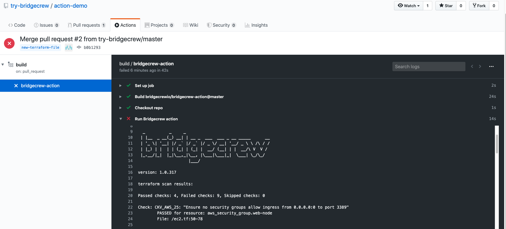
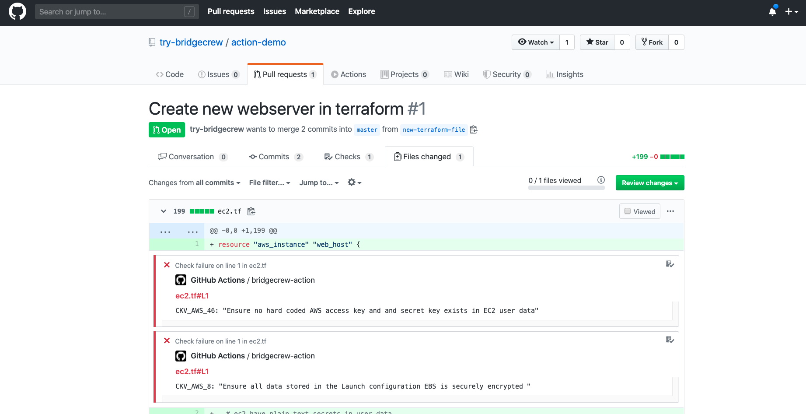

# Bridgecrew GitHub Action

## The Bridgecrew GitHub Action

Use the Bridgecrew GitHub action to scan for infrastrcture-as-code errors in your GitHub action pipeline.
By utilizing this GitHub action in your project workflow, you can automatically start to find,
fix and monitor your project for configuration errors in Terraform, CloudFormation and kubernetes. 
By signing up for a free Bridgecrew Community plan you can also view dashboards and reports. 
The community plan does not limit the number of scans or users you can invite to view the results.
​
## How to use the Bridgecrew GitHub Action

In fact, it is very easy to start using the GitHub action.
All you need to do is:

1. Follow the instructions at [GitHub configuration a workflow](https://help.github.com/en/actions/configuring-and-managing-workflows/configuring-a-workflow) to enable Github Action in your repository. 
2. Set up an environment variable with your Bridgecrew API key, which you can get from your [Bridgecrew account](https://www.bridgecrew.cloud/integrations).
3. In the app build job, uses the `bridgecrewio/bridgecrew-action@master`
4. Optionally, supply parameters to customize GitHub action behaviour
## Usage Examples

### Scan IaC in your repository

```yaml
  - name: Run Bridgecrew 
    id: Bridgecrew
    uses: bridgecrewio/bridgecrew-action@master
    with:
      api-key: ${{ secrets.API_KEY }}
```


## GitHub action Parameters

| Parameter  | Description | Required | Default | Type |
| -----------| -------------------------------------------------------------------------------------------------------- | ------------- | ------------- | ------------- |
| api-key | Environment variable name of the Bridgecrew API key from Bridgecrew app | No |  | Secret parameter |
| directory | IaC root directory to scan | No | "." | Input parameter |
| soft-fail | Runs checks without failing build | No | | Input parameters |
| check | filter scan to run only on a specific check identifier, You can specify multiple checks separated by comma delimiter | No |  | Input parameters |
| skip-check | filter scan to run on all check but a specific check identifier(blacklist), You can specify multiple checks separated by comma delimiter | No |  | Input parameters |
| quiet | display only failed checks | No |  | Input parameters |


Full reference docs [here](https://docs.bridgecrew.io/docs/integrate-with-github-actions).

## Screenshots
Reject pull requests containing infrastructure code configuration errors

Find & fix resources that might be a risk

